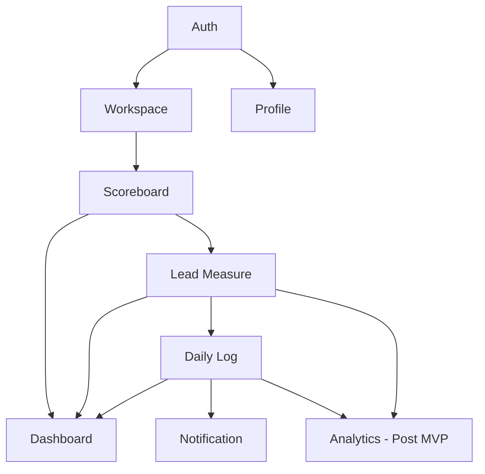

# WIG 전체 도메인 개요

## 1. 도메인 목록

| # | 도메인 ID | 도메인명 | MVP | 설계 문서 |
|---|-----------|----------|-----|-----------|
| 1 | `auth` | 인증 | ✅ | `domain-auth.md` |
| 2 | `workspace` | 워크스페이스 | ✅ | `domain-workspace.md` |
| 3 | `scoreboard` | 가중목 / 점수판 | ✅ | `domain-scoreboard.md` |
| 4 | `lead-measure` | 선행지표 | ✅ | `domain-lead-measure.md` |
| 5 | `daily-log` | 주간 기록 | ✅ | `domain-daily-log.md` |
| 6 | `dashboard` | 대시보드 | ✅ | `domain-dashboard.md` |
| 7 | `profile` | 프로필 / 설정 | ✅ | `domain-profile.md` |
| 8 | `notification` | 알림 | ✅ | `domain-notification.md` |
| 9 | `analytics` | 분석 / 통계 | ⬜ Post-MVP | `domain-analytics.md` |

---

## 2. 도메인 책임 정의

### 2.1. Auth (인증)

- **책임**: 사용자 신원 확인 및 세션 관리
- **주요 엔티티**: `User`, `Session`
- **핵심 규칙**:
  - 회원가입은 관리자(ADMIN)만 가능. 일반 자가 가입 없음.
  - 초기 비밀번호는 `user`로 일괄 지정. 최초 로그인 시 변경 권장.
  - 서버 사이드 세션 + HttpOnly 쿠키 기반 세션 관리.

### 2.2. Workspace (워크스페이스)

- **책임**: 팀(모임) 단위의 공간 생성, 초대 코드 배포, 멤버십 관리
- **주요 엔티티**: `Workspace`, `WorkspaceMember`
- **핵심 규칙**:
  - MVP: 사용자 1명당 1개 워크스페이스 가입.
  - 워크스페이스는 ADMIN이 생성하며, MEMBER가 참가.
  - 역할: `ADMIN`, `MEMBER`

### 2.3. Scoreboard (가중목 / 점수판)

- **책임**: WIG(가중목)와 후행지표(Lag Measure)를 포함하는 점수판의 생명주기 관리
- **주요 엔티티**: `Scoreboard`
- **핵심 규칙**:
  - `user_id + workspace_id` 조합당 `ACTIVE` 상태의 점수판은 **단 하나**.
  - 상태 전이: `ACTIVE` → `ARCHIVED`. 종료 후에만 새 점수판 생성 가능.
  - 후행지표(Lag Measure)는 점수판 레코드 내 텍스트 필드로 관리 (별도 테이블 없음, MVP).

### 2.4. Lead Measure (선행지표)

- **책임**: 점수판에 속하는 실행 가능한 세부 행동 지표 관리
- **주요 엔티티**: `LeadMeasure`
- **핵심 규칙**:
  - 점수판이 `ACTIVE` 상태일 때만 추가/수정/삭제 가능.
  - 소프트 삭제 대신 `status: ACTIVE | ARCHIVED` 필드로 관리.
  - 삭제(물리적)는 번들 내 히스토리 전체 제거를 의미.

### 2.5. Daily Log (주간 기록)

- **책임**: 선행지표에 대한 날짜별 O/X 달성 기록
- **주요 엔티티**: `DailyLog`
- **핵심 규칙**:
  - `(lead_measure_id, log_date)` 조합은 유일(Unique). 중복 기록 불가.
  - 과거 날짜 기록 소급 입력 허용 (사용자 편의를 위해).
  - 미래 날짜 기록은 허용하지 않음.

### 2.6. Dashboard (대시보드)

- **책임**: 나의 이번 주 점수판 현황 및 팀원 현황을 종합적으로 시각화
- **주요 엔티티**: (읽기 전용 집계. 별도 엔티티 없음)
- **핵심 규칙**:
  - 뷰 토글: `나의 지표 (My View)` ↔ `팀 전체 뷰 (Team View)`
  - 현재 My View는 별도 `/api/dashboard/me` 집계 엔드포인트가 아니라 활성 점수판 조회와 주간/월간 로그 조회 조합으로 구성된다.
  - 팀 뷰는 이번 주 선행지표 달성 현황만 노출 (개인 세부 히스토리 비공개).
  - 점수판이 없는 유저에게는 '새 점수판 만들기' CTA 노출.

### 2.7. Profile (프로필 / 설정)

- **책임**: 사용자의 개인 정보(닉네임) 및 계정 보안(비밀번호) 관리
- **주요 엔티티**: `User` (쓰기)
- **핵심 규칙**:
  - 닉네임은 워크스페이스 내 중복 가능 (식별은 user_id로).
  - 계정 탈퇴 시 관련 모든 데이터 Cascade Delete.

### 2.8. Notification (알림)

- **책임**: 기록 리마인드를 위한 푸시 알림 구독 및 발송 관리
- **주요 엔티티**: `PushSubscription`
- **핵심 규칙**:
  - PWA 기반 Web Push (VAPID).
  - 매일 밤 9시 기록 리마인드 알림.
  - 사용자가 직접 알림 on/off 제어.

### 2.9. Analytics (분석 / 통계) — Post-MVP

- **책임**: 기간별 달성률 집계, 차트 시각화, AI 코칭 메시지 제공
- **주요 엔티티**: (집계 쿼리. 별도 엔티티 없음)
- **핵심 규칙**:
  - 이번 주/이번 달/저번 주 대비 달성률 비교.
  - AI 코칭 메시지는 주간 데이터 요약을 기반으로 LLM 호출.

---

## 3. 도메인 간 의존 관계

```
Auth
 └─ 인증 성공 시 → Workspace, Profile 접근 가능

Workspace
 └─ ADMIN이 생성 → 초대 코드 배포
 └─ MEMBER 참가 → Scoreboard 생성 가능

Scoreboard (활성)
 └─ LeadMeasure 관리 가능
    └─ DailyLog 기록 가능

Dashboard
 └─ Scoreboard + LeadMeasure + DailyLog 집계 (읽기)

Analytics (Post-MVP)
 └─ DailyLog 집계 (읽기)
 └─ LeadMeasure 메타 (읽기)

Notification
 └─ User, DailyLog 기반 트리거

Profile
 └─ User 엔티티 직접 수정
```



---

## 4. 이벤트 흐름 (핵심 시나리오)

### 시나리오 A: 신규 사용자 온보딩
```
1. ADMIN이 User 계정 생성 (Auth)
2. 사용자 최초 로그인 → 비밀번호 변경 권장 토스트 (Auth)
3. 닉네임 설정 안내 (Profile)
4. 워크스페이스 초대 코드로 참가 (Workspace)
5. 점수판 생성: WIG + Lag Measure 입력 (Scoreboard)
6. 선행지표 추가: 4DX 가이드와 함께 (Lead Measure)
7. 대시보드 진입: 주간 점수판 기록 시작 (Dashboard + Daily Log)
```

### 시나리오 B: 매일 기록
```
1. 저녁 9시 PWA 푸시 알림 수신 (Notification)
2. 대시보드 접속 → 주간 점수판 확인 (Dashboard)
3. 선행지표 O/X 토글 (Daily Log)
4. 달성 시 Confetti 축하 애니메이션
```

### 시나리오 C: 주간 회의 (Meeting Mode)
```
1. 팀 전체 뷰 전환 (Dashboard - Team View)
2. 팀원 카드에서 이번 주 Win/Loss 확인
3. (Post-MVP) 미팅 모드: 순서대로 공약 체크 + 다음 주 공약 입력
```

---

## 5. API 라우트 구조 (예상)

| 도메인 | 메서드 | 경로 |
|--------|--------|------|
| Auth | POST | `/api/auth/login` |
| Auth | POST | `/api/auth/logout` |
| Auth | PUT | `/api/auth/password` |
| Workspace | GET | `/api/workspaces/me` |
| Workspace | POST | `/api/workspaces` |
| Workspace | POST | `/api/workspaces/join` |
| Workspace | GET | `/api/workspaces/:id/members` |
| Scoreboard | GET | `/api/scoreboards/active` |
| Scoreboard | POST | `/api/scoreboards` |
| Scoreboard | PUT | `/api/scoreboards/:id` |
| Scoreboard | POST | `/api/scoreboards/:id/archive` |
| Lead Measure | GET | `/api/scoreboards/:id/lead-measures` |
| Lead Measure | POST | `/api/scoreboards/:id/lead-measures` |
| Lead Measure | PUT | `/api/lead-measures/:id` |
| Lead Measure | DELETE | `/api/lead-measures/:id` |
| Daily Log | PUT | `/api/lead-measures/:id/logs/:date` |
| Daily Log | GET | `/api/scoreboards/:id/logs/weekly` |
| Daily Log | GET | `/api/scoreboards/:id/logs/monthly` |
| Dashboard | GET | `/api/dashboard/team` |
| Profile | GET | `/api/users/me` |
| Profile | PUT | `/api/users/me` |
| Profile | DELETE | `/api/users/me` |
| Notification | POST | `/api/notifications/subscribe` |
| Notification | DELETE | `/api/notifications/subscribe` |
